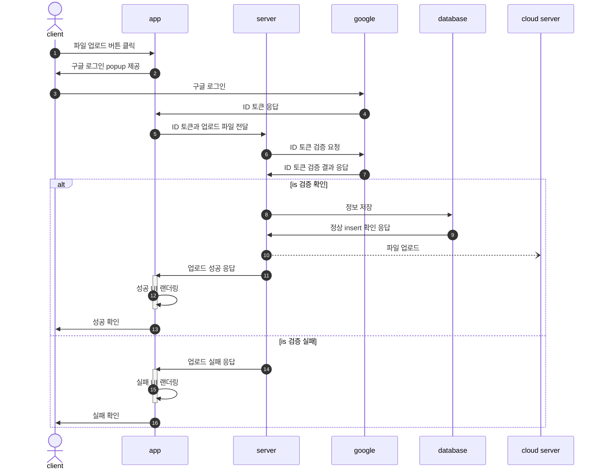

# 집 찾기 달인

### 타겟
- 실거주 및 투자 목적의 부동산 매매를 하는데에 원하는 사항은 있으나, 지역 및 단지에 대해 정보가 부족하고, 발품 및 정보 검색에 어려움을 겪고 있는 잠재적 수요자들 

### 프로젝트 이름
- 집찾심(尋)
  - 찾을 심
  - 가운데 음절인 '찾' 글자가 자연스럽지 못함
- 집찾수(搜)
  - 찾을 수
  - 가운데 음절인 '찾' 글자가 자연스럽지 못함
- 집찾슈
  - 직관적으로 서비스가 이해 가능하고, 사투리 표현으로 친근함을 줄 수 있음
- 집찾기달인
  - 직관적

### ✓ 설명
- 집을 구할 때 여러가지 조건, 밸런스 게임 등을 통해 자신이 원했던 주거환경의 지역이 어딘지, 단지는 어딘지 등의 정보를 제공하고, 추후 일부 부동산 매매 중계 플랫폼에서 해당 조건에 충족하는 매물을 확인할 수 있는 기능을 제공 할 예정

### ✓ 기대효과
- 부동산 매매에 대한 진입장벽을 낮출 수 있을 것으로 보임

### check

